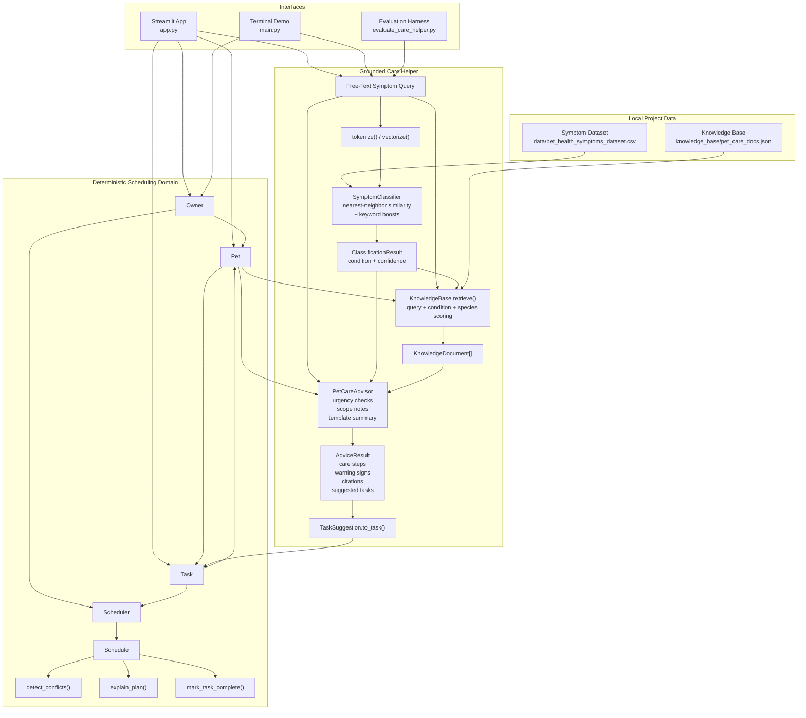
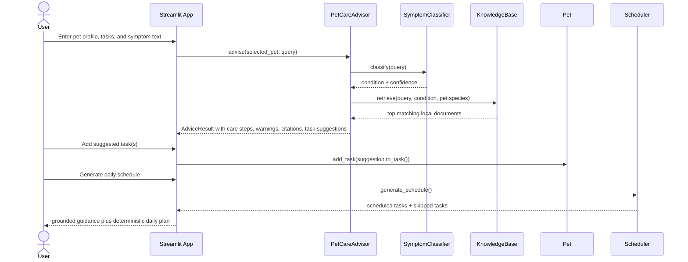

# PawPal+ Architecture

## In One Sentence

PawPal+ is a grounded pet-care workflow that turns symptom questions and daily pet tasks into one deterministic action plan.

## Problem Being Solved

Pet owners usually face two separate problems:

- routine care planning across one or more pets
- ad hoc symptom questions that need safe, practical next steps

Most tools handle only one side of that workflow. Reminder apps manage routine tasks but do not help when a pet shows symptoms. General AI chat tools can discuss symptoms but do not turn that guidance into a structured plan for the day.

This project closes that gap. It keeps scheduling deterministic, but adds a bounded AI layer that can classify a symptom description, retrieve grounded care guidance, and suggest follow-up tasks that slot into the same schedule as normal care work.

## Product Concept

The core idea is simple:

1. Keep the final action plan rule-based and inspectable.
2. Let the AI layer do only the parts it is good at here: interpreting messy text, finding relevant local guidance, and translating that guidance into suggested actions.
3. Normalize AI suggestions into the same `Task` model used by the scheduler.

That means the system behaves more like an operational assistant than an open-ended chatbot.

## System Boundary

### In Scope

- managing pet-care tasks for one owner with one or more pets
- classifying symptom text into a small, known set of care categories
- retrieving local knowledge-base guidance with citations
- surfacing warning signs and escalation language
- converting suggested follow-up actions into schedulable tasks
- generating a daily plan within a time budget

### Out Of Scope

- diagnosis
- live internet search or live medical retrieval
- complex clinical reasoning across many diseases
- full veterinary triage
- non-dog and non-cat coverage beyond a limited scope warning

## Detailed Architecture

## Symptom-To-Schedule Flow

## Module Responsibilities

| Module | Responsibility |
| --- | --- |
| `pawpal_system.py` | Core domain model and deterministic scheduling logic |
| `pawpal_ai.py` | Symptom classification, retrieval, guardrails, and grounded advice composition |
| `app.py` | Streamlit user workflow for profile setup, task management, care guidance, and schedule generation |
| `main.py` | Terminal demonstration of the end-to-end flow |
| `evaluate_care_helper.py` | Small fixed-case evaluation harness for the care helper |
| `tests/` | Automated tests for scheduler logic and care-helper behavior |

## Design Choices That Matter

### 1. AI Is Bounded, Not In Charge

The care helper does not directly decide the full plan for the day. It produces structured suggestions. The scheduler still decides what fits into the owner's time budget.

### 2. Grounding Comes From Local Data

The system does not depend on an LLM or live retrieval. It uses:

- a local symptom seed dataset for classification
- a local knowledge base for care steps, warning signs, and citations

That makes behavior reproducible and easy to demo.

### 3. One Shared Task Model

Manual care tasks and AI-suggested follow-ups both end up as `Task` objects. This keeps the system coherent instead of splitting "advice" and "execution" into separate products.

### 4. Deterministic Scheduling Improves Trust

`Scheduler.generate_schedule()` is a simple greedy priority-first algorithm. It is easy to explain, test, and inspect. That matters more here than trying to make the scheduling logic look intelligent.

### 5. Guardrails Are Explicit

The care helper includes:

- non-diagnosis framing
- urgent symptom escalation
- source citations
- limited-species scope warnings

These are concrete product decisions, not just implementation details.

## Why This Project Reads Well Technically

For a recruiter or hiring manager, the repo shows a clear product idea and a sensible AI pattern:

- use AI for fuzzy interpretation
- use retrieval for grounding
- use deterministic code for execution
- expose reasoning through citations, warnings, and explanations
- validate behavior with tests and a small evaluation harness

For an engineer, the code separates concerns cleanly:

- domain logic lives in `pawpal_system.py`
- AI-specific logic lives in `pawpal_ai.py`
- UI orchestration stays in `app.py`

That separation makes the system easy to inspect, extend, and test.
