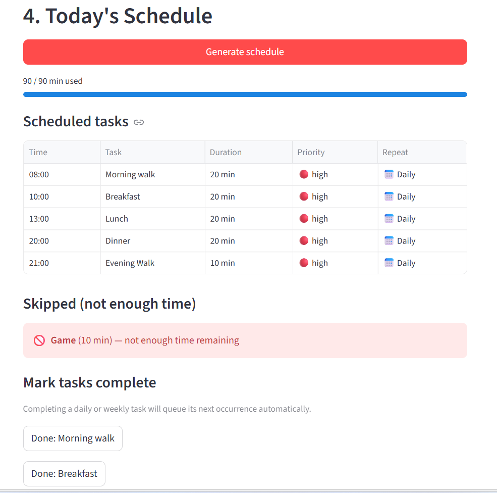
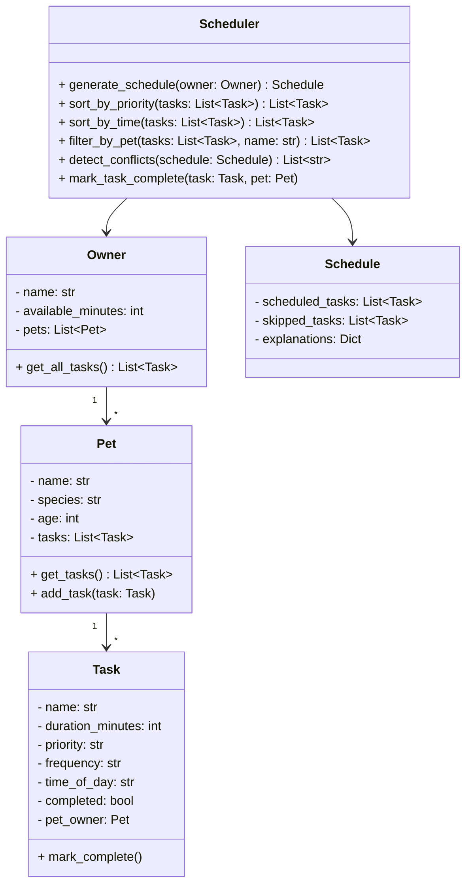

# 🐾 PawPal+

**PawPal+** is a Streamlit app that helps a busy pet owner stay consistent with daily pet care. It takes your pets, your tasks, and your available time — and builds a smart daily schedule that respects priority, detects conflicts, and handles recurring activities automatically.

---

## 📸 Demo

<a href="Screenshot.png" target="_blank"></a>

---

## Features

### Core scheduling
| Feature | Description |
|---|---|
| **Owner profile** | Set your name and how many minutes you have available today. The scheduler never exceeds this budget. |
| **Multiple pets** | Add as many pets as you have. Tasks are stored per-pet and aggregated for scheduling. |
| **Task management** | Create tasks with a name, duration, priority, category, frequency, and optional start time. Validation prevents zero-duration or invalid-priority tasks from entering the system. |
| **Greedy priority scheduler** | Generates a daily plan by sorting tasks high → medium → low and fitting them into your time budget. Uses an integer sort key (not string comparison) to guarantee correct ordering. |
| **Plan explanation** | Every schedule includes a plain-English explanation of why each task was included or skipped. |

### Smarter scheduling
| Feature | Method | Description |
|---|---|---|
| **Sort by time** | `Scheduler.sort_by_time(tasks)` | Orders tasks chronologically by `time_of_day` (`HH:MM`). Uses a lambda key — zero-padded strings sort lexicographically = chronologically. Untimed tasks sort to the end via a `"99:99"` sentinel. |
| **Filter by pet** | `Scheduler.filter_by_pet(tasks, name)` | Returns only tasks belonging to the named pet, matched by object identity to avoid false name collisions. |
| **Filter by status** | `Scheduler.filter_by_status(tasks, completed)` | Returns tasks matching a completion state (done / not done). |
| **Recurring tasks** | `Scheduler.mark_task_complete(task, pet)` | Marks a task complete and automatically queues the next occurrence. `daily` → due tomorrow (+1 day via `timedelta`). `weekly` → due in 7 days. `as-needed` → no follow-up created. |
| **Conflict detection** | `Scheduler.detect_conflicts(schedule)` | Detects tasks assigned the exact same `time_of_day` using an O(n) dict lookup (vs O(n²) nested loop). Returns warning strings — never crashes. Shown prominently in the UI before the task list. |

### Streamlit UI highlights
- **Time budget progress bar** — visual fill showing minutes used vs. available
- **Conflict warnings** — `st.warning` callouts with actionable guidance, shown before the task table
- **Sorted task table** — `st.dataframe` with time, priority badge, frequency label, and completion status
- **Mark complete buttons** — one click per task; recurring tasks show the next due date on confirmation
- **Skipped tasks** — displayed with `st.error` and the reason they were dropped

---

## Architecture



**Retrieval flow:**
```
Scheduler.generate_schedule()
  → owner.get_all_tasks()
      → for pet in owner.pets: pet.get_tasks()
          → flat list → sort by priority → greedy fit
```

**File organization:**
```
pawpal_system.py          ← logic layer (no Streamlit dependency)
app.py                    ← Streamlit UI; imports from pawpal_system
main.py                   ← terminal demo / manual test runner
tests/test_pawpal.py      ← 24 pytest tests; zero Streamlit dependency
```

---

## Setup

```bash
# 1. Create and activate a virtual environment
py -m venv .venv
.venv\Scripts\activate        # Windows
# source .venv/bin/activate   # macOS / Linux

# 2. Install dependencies
pip install -r requirements.txt

# 3. Run the app
streamlit run app.py

# 4. Run the terminal demo
python main.py

# 5. Run the test suite
pytest tests/ -v
```

---

## Tests

24 tests across 6 classes — all pass in under 0.05 seconds.

| Class | Tests | Covers |
|---|---|---|
| `TestTaskCompletion` | 2 | `mark_complete()` happy path + idempotency |
| `TestTaskAddition` | 4 | Count, bulk add, zero duration, bad priority |
| `TestSortByTime` | 4 | Chronological order, untimed to end, empty list |
| `TestRecurrence` | 5 | Daily (+1d), weekly (+7d), as-needed (None), flag set |
| `TestConflictDetection` | 5 | Duplicate slot, distinct slots, cross-pet, untimed ignored |
| `TestScheduleGeneration` | 4 | Budget cap, empty pet, no pets, priority ordering |

---

## Design notes

- **Why `Scheduler` only takes `Owner`**: All pet and task data is accessed through `owner.get_all_tasks()`. Adding a new pet never requires changing the Scheduler.
- **Why `get_total_duration()` is computed, not stored**: A stored counter can drift if tasks are added directly to the list. `sum()` is always accurate.
- **Why conflict detection uses a dict (not nested loops)**: O(n) vs O(n²). For a typical pet owner with 5–15 tasks per day, the difference is negligible, but the dict version is also shorter and easier to read.
- **Tradeoff — exact time match vs. duration overlap**: Current conflict detection only flags tasks at the exact same `HH:MM`. A 30-minute task at 08:00 and a task at 08:15 would not be flagged. See `reflection.md` section 2b for the full discussion.

---

## Project structure

```
├── app.py                  Streamlit UI
├── pawpal_system.py        Logic layer
├── main.py                 Terminal demo
├── requirements.txt        Dependencies
├── reflection.md           Design journal and AI collaboration notes
├── tests/
│   ├── __init__.py
│   └── test_pawpal.py      pytest test suite (24 tests)
└── README.md               This file
```
