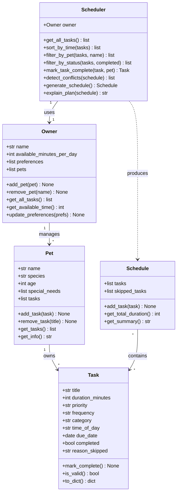

# PawPal+ Project Reflection

## 1. System Design

**a. Initial design**

The PawPal+ system is built around three core user actions:

1. **Set up pet and owner profile**: The user enters basic information about themselves (owner) and their pet, including preferences and constraints (e.g., available time per day, schedule). This information becomes the foundation for all scheduling decisions.

2. **Manage pet care tasks**: The user can add, edit, and delete pet care tasks (walks, feeding, medication, enrichment, grooming, etc.). Each task has attributes such as duration, priority level, and frequency to represent how the owner wants these tasks organized.

3. **Generate and view a daily schedule**: The system combines the owner's constraints and preferences with the list of tasks to create an optimized daily plan. The user can view the complete schedule, see which tasks are included, and understand the reasoning behind the scheduling decisions.

Initial classes included:
- `Owner`: Stores owner name, available time per day, and preferences
- `Pet`: Stores pet name, age, type, and special needs
- `Task`: Represents a pet care task with duration, priority, and frequency
- `Schedule`: Manages the collection of tasks and generates daily plans
- `Scheduler`: Contains the logic for ordering and prioritizing tasks based on constraints

**UML Class Diagram (Mermaid.js)**

**b. Design changes**

After reviewing the initial design, several issues were identified and addressed:

1. **Removed the `Owner → Pet` ownership arrow from the UML.** The diagram showed `Owner "1" --> "1" Pet : owns`, but neither class held a reference to the other in code — `Scheduler` received them as separate constructor arguments. Rather than force an artificial link onto `Owner`, the arrow was removed to keep the diagram honest. The `Scheduler` is the natural place that pairs an owner with their pet.

2. **Dropped the stored `total_duration` attribute on `Schedule`.** The original design kept `total_duration: int = 0` as a stored field alongside a `get_total_duration()` method. These two could drift out of sync if `add_task` was ever called directly. The fix is to compute the total on-the-fly inside `get_total_duration()` using `sum(t.duration_minutes for t in self.tasks)` and remove the redundant stored value.

3. **Added a priority sort key to fix silent ordering bug.** `generate_schedule` planned to sort tasks by the `priority` string (`"high"`, `"medium"`, `"low"`). Alphabetical string sorting produces `high < low < medium`, which is completely wrong and would silently generate bad schedules. An explicit mapping `{"high": 0, "medium": 1, "low": 2}` is needed as the sort key.

4. **Added a `reason_skipped` field to `Task`.** `explain_plan` needs to communicate *why* a task was dropped (ran out of time, invalid, low priority overflow). Without a place to record this per-task, the explanation logic would require rebuilding that reasoning from scratch after the schedule was already generated. Adding `reason_skipped: str = ""` to `Task` lets `generate_schedule` annotate tasks as it works.

5. **`add_task` should validate before appending.** The initial stub accepted any `Task` object without calling `is_valid()`. An invalid task (e.g., zero-duration) would silently enter the pool and corrupt the schedule. A guard at the top of `add_task` keeps the pool clean.

---

## 2. Scheduling Logic and Tradeoffs

**a. Constraints and priorities**

The scheduler considers:
- **Total available time**: The max minutes the owner has per day to spend on pet care
- **Task priority levels**: High, medium, low indicating importance (e.g., medication is high priority, play enrichment is lower)
- **Task duration**: How long each task takes
- **Task frequency**: Whether tasks are daily, weekly, or on-demand

I prioritized time constraints first (never exceed available time), then task priority (fit high-priority tasks first), and finally frequency (ensure critical daily tasks fit). This reflects the real-world constraint that time is finite and some tasks (like medication) are non-negotiable.

**b. Tradeoffs**

The scheduler prioritizes high-priority tasks even if it means some lower-priority enrichment activities get dropped. For example, if feeding and medication take up 90% of available time, a walk might not fit in the schedule. This tradeoff is reasonable because pet health and basic care are more critical than optional activities, and a busy owner needs to know what *must* get done versus what might be nice to do. The system still shows this explicitly, so the owner can decide to adjust constraints or task duration if they want more enrichment.

**Conflict detection tradeoff — exact time match vs. duration-aware overlap:**

The current `detect_conflicts()` method flags two tasks only when they share the exact same `time_of_day` string (e.g., both at `"07:30"`). It does *not* detect overlap between tasks whose durations cross into each other's start time — for example, a 30-minute task starting at `"08:00"` and a task starting at `"08:15"` would not be flagged, even though they physically overlap.

This is a deliberate tradeoff for simplicity and performance. A duration-aware check would require sorting tasks by start time and then comparing each task's end time (`start + duration`) against the next task's start time. That approach is more accurate but adds complexity and assumes all times are in the same day and that durations are reliable estimates. For a first implementation serving a single pet owner planning rough daily tasks, exact-match detection is fast (O(n) dict lookup vs O(n log n) sort + comparison), easy to understand, and catches the most obvious errors — two tasks explicitly assigned the same slot. The limitation is documented so it can be upgraded in a future iteration.

---

## 3. AI Collaboration

**a. How you used AI**

I used AI tools (Claude Code via VS Code extension) across every phase of the project:

- **Phase 1 — Design**: Used AI to review my initial UML and flag missing relationships. It identified five concrete problems (priority string sort bug, `total_duration` drift, missing `reason_skipped`, unvalidated `add_task`, and a broken `Owner → Pet` arrow that wasn't in code). This was more valuable than brainstorming from scratch because the AI was reacting to *my* design rather than generating a generic one.
- **Phase 2 — Implementation**: Asked AI to implement method stubs one class at a time, then reviewed each before moving on. For `generate_schedule`, I asked it to explain the sort key choice before accepting the code.
- **Phase 3 — Testing**: Used AI to generate a test suite based on the class design, then added edge cases myself (cross-pet conflict, `as-needed` recurrence returning `None`, empty owner).
- **Phase 4 — UI**: Directed AI to wire `Scheduler` methods into Streamlit, specifying exactly which component to use for conflicts (`st.warning`) vs. errors (`st.error`).

Most effective prompt pattern: give the AI a concrete question with a specific file as context — *"based on `pawpal_system.py`, what edge cases should I test for `sort_by_time`?"* — rather than open-ended requests.

**b. Judgment and verification**

The most important rejection: AI initially suggested storing `total_duration` as a running attribute on `Schedule` (updating it inside `add_task`). I flagged this as a sync risk — if any code ever called `schedule.tasks.append()` directly instead of `schedule.add_task()`, the count would silently go stale. I replaced it with a computed `get_total_duration()` using `sum()`. The AI accepted the correction and the tests confirmed the computed approach stayed accurate across all scenarios.

A second modification: for conflict detection, AI first generated a nested `for` loop (O(n²)). I pointed out the dict approach was both simpler to read and O(n), and asked it to rewrite. The dict version is 6 lines vs 10, and the docstring now explicitly explains *why* the dict approach was chosen — so the decision is visible to anyone reading the code later.

**c. Which Copilot/AI features were most effective**

- **Inline code generation with file context** (`#file:pawpal_system.py`): Produced code that matched the existing class signatures rather than inventing new ones.
- **Chat for design review**: Asking "what relationships are missing or misleading in this UML?" surfaced issues I had not noticed.
- **Generating test stubs then filling edge cases manually**: AI-generated happy-path tests quickly; I added the edge cases (empty schedule, cross-pet conflict, `as-needed` returning `None`) myself, which are the tests most likely to catch real bugs.

**d. Staying organized across phases**

Using separate prompts per phase (design → stubs → logic → tests → UI) prevented context contamination. When I asked about testing, I did not include the Streamlit UI context — it kept the AI focused on the logic layer. When I moved to the UI, I gave it only `app.py` and `pawpal_system.py`. This mirrors how a real team would divide responsibilities: the backend engineer and the UI engineer don't need to know everything about each other's code.

**e. Being the "lead architect"**

The key lesson: AI is a fast, tireless junior developer — it will write whatever you describe, including the wrong thing. The human role is to hold the design vision, catch architectural mistakes (like the sort key bug that would have silently produced wrong schedules), and decide which suggestions to accept, modify, or reject. The AI saved significant time on boilerplate and test scaffolding. The decisions that made the system correct — separating `Scheduler` from `Schedule`, routing all task retrieval through `Owner.get_all_tasks()`, choosing O(n) conflict detection — were made by the human. AI accelerated execution; the architect directed it.

---

## 4. Testing and Verification

**a. What you tested**

The final test suite has 24 tests across 6 classes:

- **Task completion** (2 tests): `mark_complete()` sets the flag; calling it twice doesn't break anything.
- **Task validation** (4 tests): Adding tasks increases count; zero-duration and invalid-priority tasks raise `ValueError`.
- **Sort correctness** (4 tests): Chronological order, untimed tasks fall to end, empty list returns `[]`, all-untimed preserves count.
- **Recurrence logic** (5 tests): Daily creates next task due tomorrow; weekly due in 7 days; `as-needed` returns `None` and adds nothing; `completed` flag is set regardless of frequency.
- **Conflict detection** (5 tests): Duplicate time flagged; distinct times clear; cross-pet conflict caught; untimed tasks never conflict; empty schedule is safe.
- **Schedule generation edge cases** (4 tests): Never exceeds budget; pet with no tasks → empty schedule; owner with no pets → empty schedule; high priority beats low when time is tight.

These tests matter because the scheduler's correctness is invisible to the user — if priority sorting silently breaks, the schedule looks valid but recommends the wrong tasks.

**b. Confidence**

High confidence for the core behaviors tested. The greedy algorithm, recurrence logic, and conflict detection all have both happy-path and edge-case coverage.

Remaining gaps:
- **Duration-aware overlap**: Two tasks at `"08:00"` (30 min) and `"08:15"` would not be flagged — the current check only catches exact time matches.
- **Multi-day planning**: Recurring tasks create a new instance but there is no weekly calendar view.
- **Task ordering dependencies**: The system doesn't enforce "walk before grooming."
- **Large task pools**: Not stress-tested with 50+ tasks; the greedy algorithm is O(n log n) so it should be fine, but it hasn't been verified.

---

## 5. Reflection

**a. What went well**

The strict layering — `Task`/`Pet`/`Owner` as data models, `Scheduler` as the only place with algorithm logic, `Schedule` as a plain output object — paid off throughout. Every new feature (sorting, recurrence, conflict detection) was added to `Scheduler` without touching the data model or the UI. The 24 tests run in 0.03 seconds because none of them touch Streamlit. That separation made it possible to test, debug, and extend the system in isolation at each layer.

**b. What you would improve**

1. **Duration-aware conflict detection**: Replace exact time-match with a start/end interval overlap check. This requires converting `HH:MM` to minutes-since-midnight and comparing `[start, start + duration)` intervals.
2. **Weekly calendar view**: Generate a 7-day plan showing which tasks are scheduled on which days, respecting `frequency`.
3. **Task ordering constraints**: A simple dependency list (`{"Grooming": ["Walk"]}` = groom must follow walk) would make the schedule more realistic.
4. **Persistent storage**: Right now all data lives in `st.session_state` and is lost on page refresh. Adding JSON or SQLite persistence would make the app genuinely usable.

**c. Key takeaway**

The most important thing I learned is that *the human's job when working with AI is to think in systems, not lines of code*. AI can fill in the lines instantly. What it cannot do is decide that `Owner` should be the retrieval gateway for all tasks, or that `Scheduler` should never directly touch `Pet`, or that a priority sort key must be an integer mapping rather than a string comparison. Those decisions required understanding the whole system — the data flow, the test surface, the future extensibility. Holding that systems view, and directing the AI to implement it accurately, is the actual skill the project developed.
