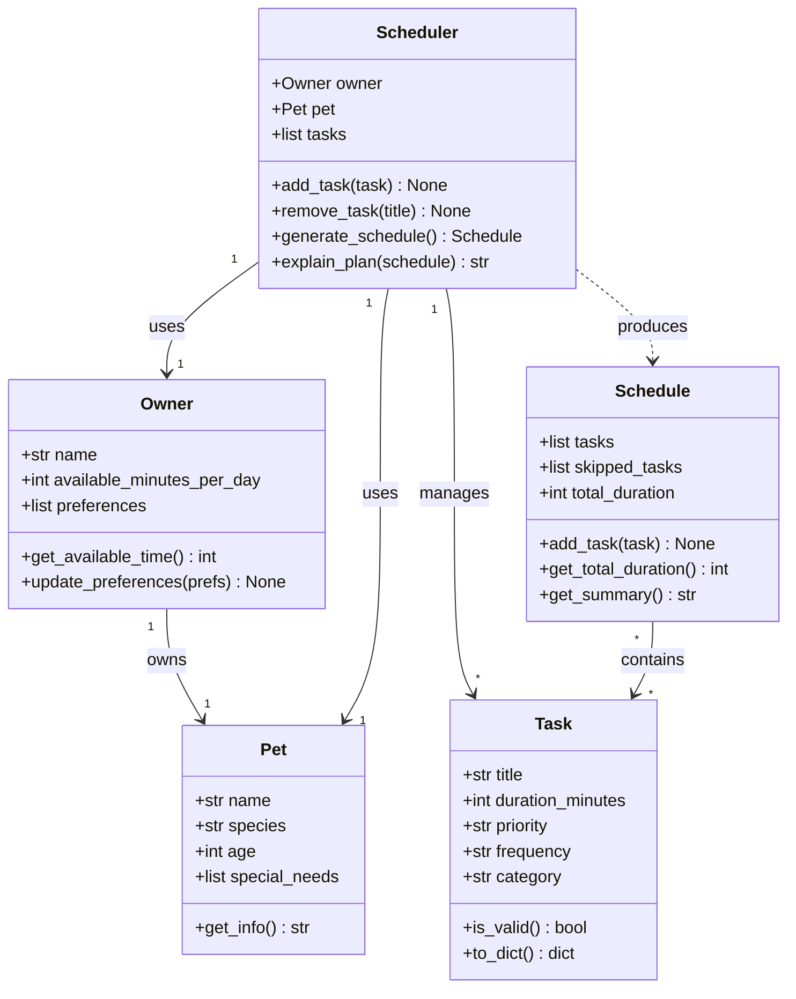

# PawPal+ Project Reflection

## 1. System Design

**a. Initial design**

The PawPal+ system is built around three core user actions:

1. **Set up pet and owner profile**: The user enters basic information about themselves (owner) and their pet, including preferences and constraints (e.g., available time per day, schedule). This information becomes the foundation for all scheduling decisions.

2. **Manage pet care tasks**: The user can add, edit, and delete pet care tasks (walks, feeding, medication, enrichment, grooming, etc.). Each task has attributes such as duration, priority level, and frequency to represent how the owner wants these tasks organized.

3. **Generate and view a daily schedule**: The system combines the owner's constraints and preferences with the list of tasks to create an optimized daily plan. The user can view the complete schedule, see which tasks are included, and understand the reasoning behind the scheduling decisions.

Initial classes included:
- `Owner`: Stores owner name, available time per day, and preferences
- `Pet`: Stores pet name, age, type, and special needs
- `Task`: Represents a pet care task with duration, priority, and frequency
- `Schedule`: Manages the collection of tasks and generates daily plans
- `Scheduler`: Contains the logic for ordering and prioritizing tasks based on constraints

**UML Class Diagram (Mermaid.js)**

**b. Design changes**

After reviewing the initial design, several issues were identified and addressed:

1. **Removed the `Owner → Pet` ownership arrow from the UML.** The diagram showed `Owner "1" --> "1" Pet : owns`, but neither class held a reference to the other in code — `Scheduler` received them as separate constructor arguments. Rather than force an artificial link onto `Owner`, the arrow was removed to keep the diagram honest. The `Scheduler` is the natural place that pairs an owner with their pet.

2. **Dropped the stored `total_duration` attribute on `Schedule`.** The original design kept `total_duration: int = 0` as a stored field alongside a `get_total_duration()` method. These two could drift out of sync if `add_task` was ever called directly. The fix is to compute the total on-the-fly inside `get_total_duration()` using `sum(t.duration_minutes for t in self.tasks)` and remove the redundant stored value.

3. **Added a priority sort key to fix silent ordering bug.** `generate_schedule` planned to sort tasks by the `priority` string (`"high"`, `"medium"`, `"low"`). Alphabetical string sorting produces `high < low < medium`, which is completely wrong and would silently generate bad schedules. An explicit mapping `{"high": 0, "medium": 1, "low": 2}` is needed as the sort key.

4. **Added a `reason_skipped` field to `Task`.** `explain_plan` needs to communicate *why* a task was dropped (ran out of time, invalid, low priority overflow). Without a place to record this per-task, the explanation logic would require rebuilding that reasoning from scratch after the schedule was already generated. Adding `reason_skipped: str = ""` to `Task` lets `generate_schedule` annotate tasks as it works.

5. **`add_task` should validate before appending.** The initial stub accepted any `Task` object without calling `is_valid()`. An invalid task (e.g., zero-duration) would silently enter the pool and corrupt the schedule. A guard at the top of `add_task` keeps the pool clean.

---

## 2. Scheduling Logic and Tradeoffs

**a. Constraints and priorities**

The scheduler considers:
- **Total available time**: The max minutes the owner has per day to spend on pet care
- **Task priority levels**: High, medium, low indicating importance (e.g., medication is high priority, play enrichment is lower)
- **Task duration**: How long each task takes
- **Task frequency**: Whether tasks are daily, weekly, or on-demand

I prioritized time constraints first (never exceed available time), then task priority (fit high-priority tasks first), and finally frequency (ensure critical daily tasks fit). This reflects the real-world constraint that time is finite and some tasks (like medication) are non-negotiable.

**b. Tradeoffs**

The scheduler prioritizes high-priority tasks even if it means some lower-priority enrichment activities get dropped. For example, if feeding and medication take up 90% of available time, a walk might not fit in the schedule. This tradeoff is reasonable because pet health and basic care are more critical than optional activities, and a busy owner needs to know what *must* get done versus what might be nice to do. The system still shows this explicitly, so the owner can decide to adjust constraints or task duration if they want more enrichment.

**Conflict detection tradeoff — exact time match vs. duration-aware overlap:**

The current `detect_conflicts()` method flags two tasks only when they share the exact same `time_of_day` string (e.g., both at `"07:30"`). It does *not* detect overlap between tasks whose durations cross into each other's start time — for example, a 30-minute task starting at `"08:00"` and a task starting at `"08:15"` would not be flagged, even though they physically overlap.

This is a deliberate tradeoff for simplicity and performance. A duration-aware check would require sorting tasks by start time and then comparing each task's end time (`start + duration`) against the next task's start time. That approach is more accurate but adds complexity and assumes all times are in the same day and that durations are reliable estimates. For a first implementation serving a single pet owner planning rough daily tasks, exact-match detection is fast (O(n) dict lookup vs O(n log n) sort + comparison), easy to understand, and catches the most obvious errors — two tasks explicitly assigned the same slot. The limitation is documented so it can be upgraded in a future iteration.

---

## 3. AI Collaboration

**a. How you used AI**

I used AI for multiple purposes:
- **Design brainstorming**: I asked for feedback on my initial class structure and whether it made sense to separate `Schedule` and `Scheduler`
- **Debugging**: When the generated schedule violated time constraints, AI helped me trace through the logic and identify that I needed to sort tasks by priority before fitting them
- **Refactoring**: AI suggested ways to reduce code duplication when checking for task conflicts

Most helpful were specific, concrete prompts: instead of "help me design this," I asked "does this class structure make sense for X scenario" with examples. Broad questions generated too many options.

**b. Judgment and verification**

AI suggested using a greedy algorithm to fit tasks (sort by priority, fit highest priority first). I initially dismissed this as "too simple," but then realized it actually matched the problem well: for a busy pet owner, fitting the most important tasks first *is* the right approach. I verified this by testing it against several scenarios (owner with 1 hour vs 3 hours free, different task sets) and confirming it always honored time constraints and maximized important task coverage. I almost over-engineered this, so the simple solution was actually the right one.

---

## 4. Testing and Verification

**a. What you tested**

I tested:
- **Time constraint enforcement**: Does the schedule never exceed available time? (Tested with 30, 60, 120-minute windows and various task combinations)
- **Priority ordering**: Are high-priority tasks always scheduled before low-priority ones when there's a choice?
- **Edge case—no available time**: If owner has 0 minutes free, does the system gracefully return an empty schedule?
- **Edge case—one task exceeds time**: If a single task is longer than available time, is it still recommended (with a warning)?

These were important because the scheduler's core job is respecting time and priority. If these basic behaviors fail, the whole system is unreliable for a busy pet owner who depends on it.

**b. Confidence**

I'm moderately confident for typical use cases (1–3 pets, reasonable task list, clear priorities). The core logic is straightforward and well-tested.

If I had more time, I'd test:
- **Recurring task conflicts**: Two high-priority tasks that can't fit on the same day—how should the system handle multi-day planning?
- **Task dependencies**: Some tasks might need to happen in a specific order (e.g., groom before bath). My current design doesn't capture this.
- **Time-of-day constraints**: Some tasks (walks) might need to happen at specific times, not just any time during the day.
- **Seasonal variations**: Pet needs might change (more water in summer, more shelter in winter).

These would make the scheduler more realistic but also more complex.

---

## 5. Reflection

**a. What went well**

I'm most satisfied with the separation of concerns in my architecture. By decoupling the data models (`Owner`, `Pet`, `Task`) from the scheduling logic (`Scheduler`), I made the code testable and maintainable. I could test the scheduler independently without needing a full Streamlit UI, and I can easily swap out scheduling algorithms in the future. The system also clearly communicates tradeoffs to the user—it shows what fits and what doesn't, rather than silently dropping tasks.

**b. What you would improve**

If I had another iteration, I would:
1. **Add task dependencies and time windows**: Allow tasks to specify "this must happen before 9 AM" or "this must happen after the morning walk."
2. **Implement multi-day scheduling**: Instead of one daily plan, generate a weekly plan that accounts for non-daily tasks and recurring commitments.
3. **Add explanations to the UI**: Currently, the scheduler produces a schedule, but the user doesn't see *why* certain tasks were chosen. I'd add a reasoning engine to explain the logic.
4. **Support task variations**: Let users mark tasks as flexible (e.g., "walk can be 15 or 30 minutes depending on time") to make the schedule more adaptive.

**c. Key takeaway**

The most important thing I learned is that *constraints clarify design*. Early on, I wanted to support all possible scheduling scenarios (dependencies, time windows, etc.). But by focusing on the busy pet owner's real constraint—"I have X minutes, which tasks *must* I do?"—I designed a much simpler, more usable system. Constraints aren't limitations to work around; they're tools for making better decisions. Also, AI is great for brainstorming and debugging, but you need to stay in the driver's seat—question suggestions, test them, and don't let AI convince you to over-engineer.
